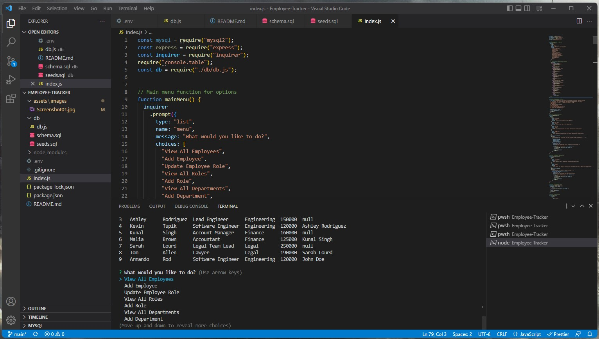
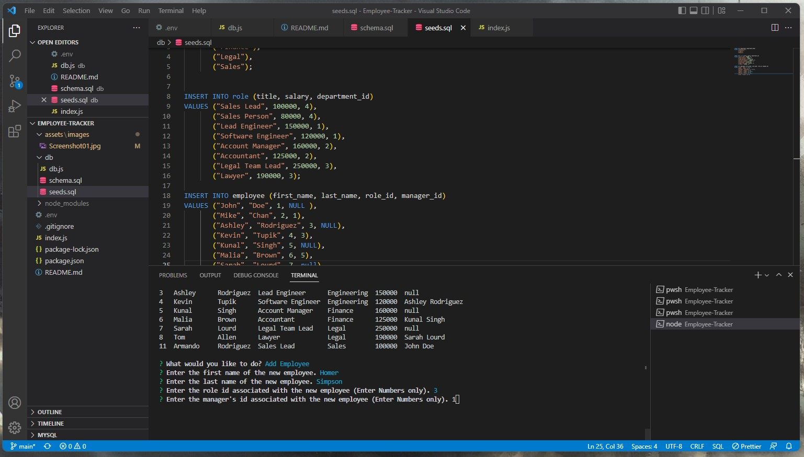

# Employee-Tracker

## Description

A short description explaining the what, why, and how of project "Employee-Tracker":

An application called "Employee-Tracker" that is a command-line application which can manage a company's employee database, using Node.js, Inquirer, and MySQL.

A walkthrough video that demonstrates its functionality is included with a link to the video of your project. 

## User Story

AS A business owner

I WANT to be able to view and manage the departments, roles, and employees in my company

SO THAT I can organize and plan my business

## Acceptance Criteria

GIVEN a command-line application that accepts user input

WHEN I start the application

THEN I am presented with the following options: view all departments, view all roles, view all employees, add a department, add a role, add an employee, and update an employee role

WHEN I choose to view all departments

THEN I am presented with a formatted table showing department names and department ids

WHEN I choose to view all roles

THEN I am presented with the job title, role id, the department that role belongs to, and the salary for that role

WHEN I choose to view all employees

THEN I am presented with a formatted table showing employee data, including employee ids, first names, last names, job titles, departments, salaries, and managers that the employees report to

WHEN I choose to add a department

THEN I am prompted to enter the name of the department and that department is added to the database

WHEN I choose to add a role

THEN I am prompted to enter the name, salary, and department for the role and that role is added to the database

WHEN I choose to add an employee

THEN I am prompted to enter the employee’s first name, last name, role, and manager, and that employee is added to the database

WHEN I choose to update an employee role

THEN I am prompted to select an employee to update and their new role and this information is updated in the database

## Installation

Pulling the GitHub repository from the follwing URL: https://github.com/RamRod79/Employee-tracker.git and typing the follwoing command ,'npm install', in the terminal will ensure the dependencies are installed and the program can run properly.

- Download and run mysql server.

- Download the repository to your own local machine and run it from your command line.

- Run ```npm i``` or ```npm install``` in order to download all the dependencies.

- MySQL instructions to create your tables:

        - Enter ```mysql -u root -p``` in the terminal window.
        - Enter your mysql password. 
        - Create database by entering ```CREATE DATABASE employeeTracker_db;``` and enter.
        - Then enter ```SHOW databases;```.
        - To use the employees database; enter ```USE employeeTracker_db;```.
        - In order to use your .sql files enter ```source db/schema.sql;``` and enter, then type ```source db/seeds.sql;``` and enter.
        - Exit MySQL by entering ```quit;```.
  
  Run ```node index.js``` or ```npm start``` in your terminal to satrt.

## Usage




## Credits

List of collaborators:

- UCLA Extension, Coding Bootcamp Instructor and TAs

## License

The following licenses have been used in the development of this project:

[](https://opensource.org/licenses/MIT)

## Badges


## Repo Features

Using this repo can be initiated by running 'npm run Start' in the command terminal after opening the integrated terminal to initiate the program. Using this repo requires express and nodemon, and updated node modules to ensure application runs properly.

## How to Contribute

If other developers would like to contribute, you can contact me at armando.rod79@gmail.com.

## URL
GitHub: https://github.com/RamRod79/Employee-tracker.git
video:

## Contact Info

For any other issues or comments please contact me at:

GitHub username: RamRod79

Email: armando.rod79@gmail.com